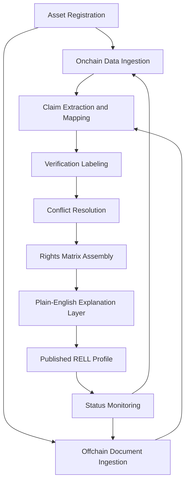

# System Mechanism

This describes how a rights profile gets built and kept current — conceptually, not as an implementation spec.

## Pipeline Overview

## 1. Asset Registration

An asset is added by identifying its token contract, chain, token standard, and the underlying real-world asset it references. This becomes the anchor for everything else in the profile.

## 2. Onchain Data Ingestion

The token contract and related contracts are read to determine supply, transfer/pause logic, admin/ownership controls, and any oracle or DeFi integration points.

## 3. Offchain Document Ingestion

Issuer terms, legal structure documents, and disclosure materials are collected and mapped against the six rights categories.

## 4. Claim Extraction & Mapping

Each leaf in the [Data Model](data-model.md) is populated from whichever source (onchain or offchain) is authoritative for that specific claim.

## 5. Verification Labeling

Every populated claim is tagged with one of the three [verification labels](verification-system.md), based on how it was sourced.

## 6. Conflict Resolution

Where onchain and offchain evidence disagree, both are retained and shown side by side rather than collapsed into a single answer (see [Verification System](verification-system.md)).

## 7. Rights Matrix Assembly

The individual claims are assembled into the standardized rights matrix — the same format used across every asset, so profiles remain comparable.

## 8. Plain-English Explanation Layer

Each claim in the matrix is paired with a short, non-technical explanation of what it means in practice for the holder.

## 9. Status Monitoring

Assets are re-checked when trigger events occur — a corporate action, a contract upgrade, a pause/freeze event, or a revision to issuer documentation — rather than on a fixed schedule alone. A re-check re-runs the pipeline from ingestion.

## 10. Publishing

The finished profile is what a user sees when they search or look up an asset, along with its sources and last-updated timestamp.
